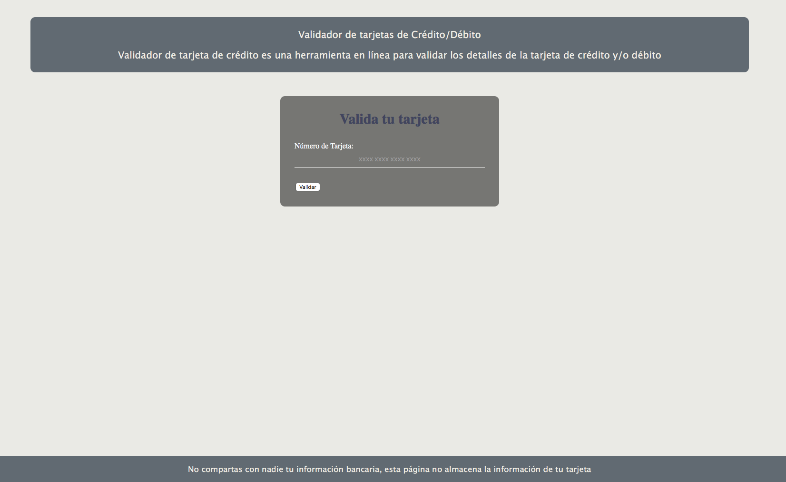
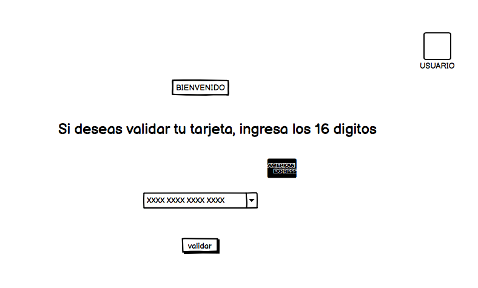
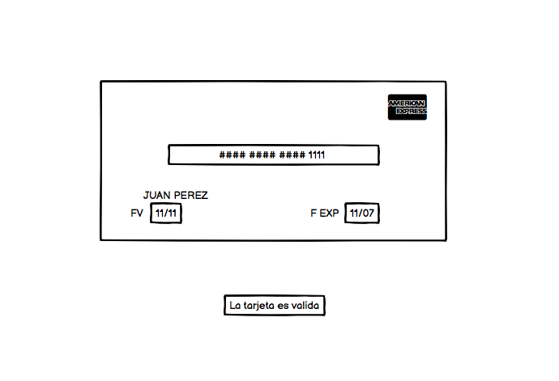

# Tarjeta de crédito válida

## Índice

* [1. Preámbulo](#1-preámbulo)
* [2. Resumen del proyecto](#2-resumen-del-proyecto)
* [3. Prototipo Final](#3-prototipo-final)
* [4. Prototipo de baja fidelidad](#4-prototipo-de-baja-fidelidad)
* [5. Uso de la pagina](#5-uso-de-la-pagina)

***

## 1. 

El [algoritmo de Luhn](https://es.wikipedia.org/wiki/Algoritmo_de_Luhn),
también llamado algoritmo de módulo 10, es un método de suma de verificación,
se utiliza para validar números de identificación; tales como el IMEI de los
celulares, tarjetas de crédito, etc.

Este algoritmo es simple. Obtenemos la reversa del número a verificar (que
solamente contiene dígitos [0-9]); a todos los números que ocupan una posición
par se les debe multiplicar por dos, si este número es mayor o igual a 10,
debemos sumar los dígitos del resultado; el número a verificar será válido si
la suma de sus dígitos finales es un múltiplo de 10.

## 2. Resumen del proyecto

Este proyecto consta de una interfaz que permite validar tarjetas de crédito y debito, para los clientes
que necesiten validar su numero de tarjeta, por las variantes que existen en las tarjetas digitales por ejemplo,
o en su caso saber antes de probar por primera vez su tarjeta en linea.

## 3. Prototipo final

## 4. Prototipo de baja fidelidad

## 5. Uso de la página

Debido al incremento de creación de tarjetas digitales, es necesario
implementar un metodo que permita validar los numeros de tarjetas que se han generado,
generando confianza en el cliente que recibe la tarjeta para estar preparado a su
uso en el momento que se desee. De esta forma el cliente tendrá en cuenta si su tarjeta
es correcta para iniciar compras.

